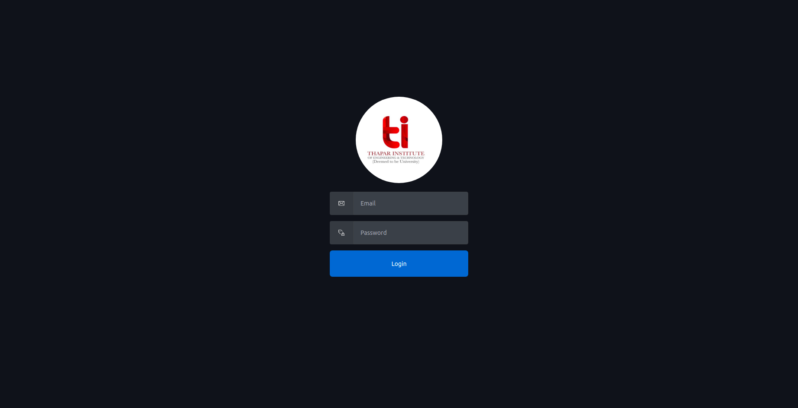
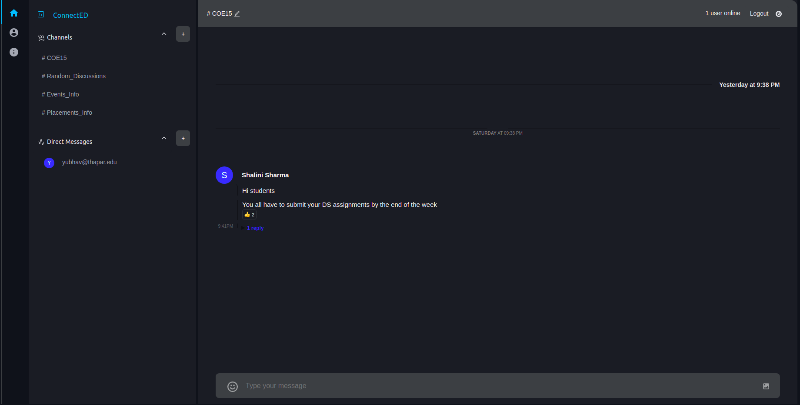
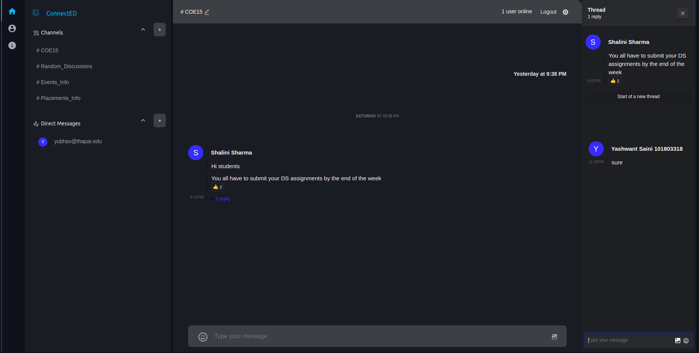
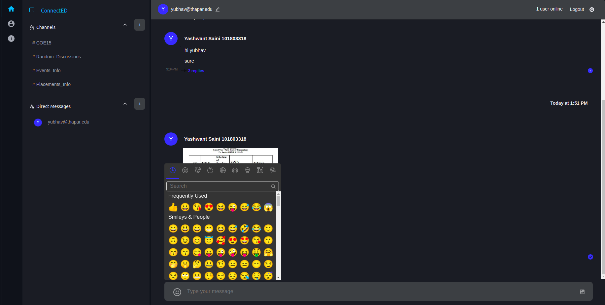
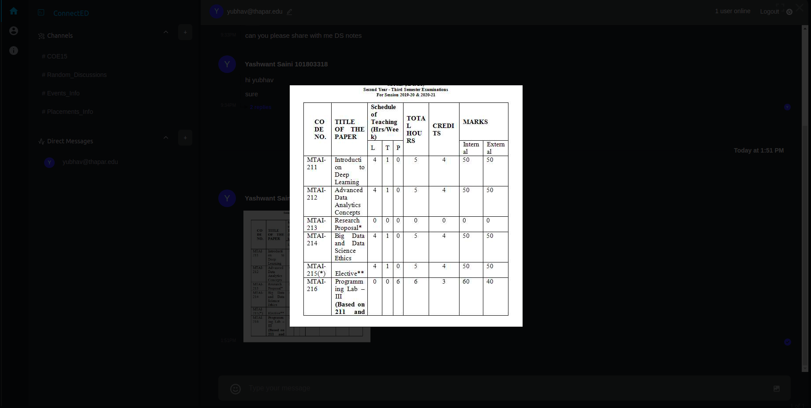
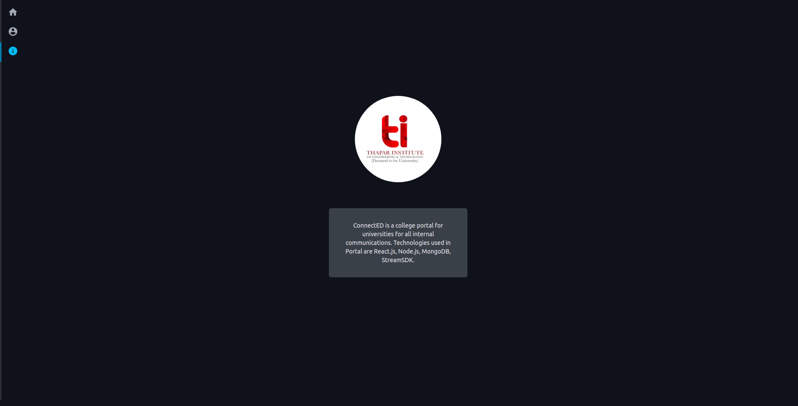

<h1 align="center">
  <br>
  <a href=""></a>
  <br>
    ConnectED
  <br>
</h1>

<h4 align="center">An Internal College platform for students and teachers for easy communication and collaboration.</h4>
<br />








## 🚀 Features

- Teachers can create public channels and add students in their channels for easy collaboration.
- Students can create private channels and add students/teachers in their channels for easy communication.
- Students/Teachers can post queries/blogs in public channels or classroom channels.
- A separate thread for each message can be created so that students can reply/ask queries regarding the post.
- Emojis are also available which can be sent along with messages or can be added to each message as well (reactions).
- Admins can provide access to students/teachers and define roles of each user.

## 🔥 Getting Started

#### Clone the repo

```
git clone https://github.com/meyash/ConnectED.git
```

#### Add ENV Variables Server (.env)

```
PORT=5000
MONGO_URI=
JWT_SECRET=
NODE_ENV=production
STREAM_API_KEY=
STREAM_API_SECRET=
STREAM_APP_ID=
ADMIN_EMAIL=
ADMIN_PASSWORD=
ADMIN_COOKIE_NAME=
ADMIN_COOKIE_PASS=
```

#### Add ENV Variables Client (.env)

```
REACT_APP_STREAM_API_KEY=
REACT_APP_SERVER_URL=
```

#### Install NPM packages

```
npm install
```

#### Start the react server

```
npm start
```

## 🚀Technologies Used

- [React.js](https://reactjs.org/)
- [Node.js](https://nodejs.org/)
- [MongoDB](https://www.mongodb.com/)
- [Stream](https://getstream.io/chat/)

## Sample Users
- user=> yashwant@thapar.edu pass=>yashwant@thapar.edu
- user=> yubhav@thapar.edu pass=>yubhav@thapar.edu
- user=> shalini@thapar.edu pass=>shalini@thapar.edu

## 📌 Contributors

<br />

<a href="https://meyash.xyz/" style="margin-right:30px;"></a>
<a href="https://meyash.xyz/resume.pdf" style="margin-right:30px;"></a>
<a href="https://www.linkedin.com/in/meyash21/" style="margin-right:30px;"></a>
<a href="https://twitter.com/meyash21" style="margin-right:30px;"></a>
<a href="https://www.instagram.com/meyash21/" style="margin-right:30px;"></a>
<a href="https://www.codechef.com/users/meyash21" style="margin-right:30px;"></a>
